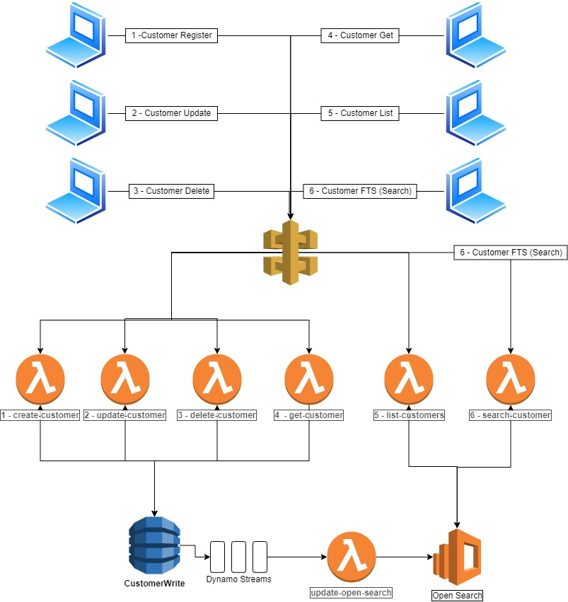

# Introduction

Service built with [Serverless framework](https://www.serverless.com/) and [Typescript](https://www.typescriptlang.org/) to manage customers from [Pagaleve](https://www.pagaleve.com.br/)

# Architecture



# Compiling

You can compile the ts files in this directory by 1st installing typescript via

`yarn add typescript`

then

`yarn add`

You can then run the compiler by running `tsc`or `yarn build` in this directory. It will pull the settings from .tsconfig and extra @types
from package.json. The output create.js file is what will be uploaded by serverless.

you could also use `yarn local` to start serverless structure in offline mode, when your code is done you can deploy it using `yarn deploy`


## Usage

You can create, retrieve, update, delete or do a full text search customers with the following commands:

### Create a Customer

```bash
curl --location --request POST 'https://localhost/customer' \
--header 'Content-Type: application/json' \
--data-raw '{
    "email": "lucasdeoutronome@hotmail.com",
    "age": 18,
    "password": "123212"
}'
```


### List all Customers

```bash
curl --location --request GET 'https://localhost/customer/list'
```

Example Result:
```bash
[
  {
    "email": "teste@hotmail.com",
    "age": 18
  },
  {
    "email": "teste2@hotmail.com",
    "age": 18
  },
]
```

### Get Customer

```bash
# Replace the <email> part with a real email from your customer table
curl --location --request GET 'https://localhost/customer?email={email}'
```

Example Result:
```bash
{
    "email": "teste@hotmail.com",
    "age": 24
}
```

### Update a Customer

```bash
curl --location --request PUT 'https://7gtd1g7htj.execute-api.us-east-1.amazonaws.com/dev/customer' \
--header 'Content-Type: application/json' \
--data-raw '{
    "email": "teste@hotmail.com",
    "password": "12",
    "age": 24
}'
```